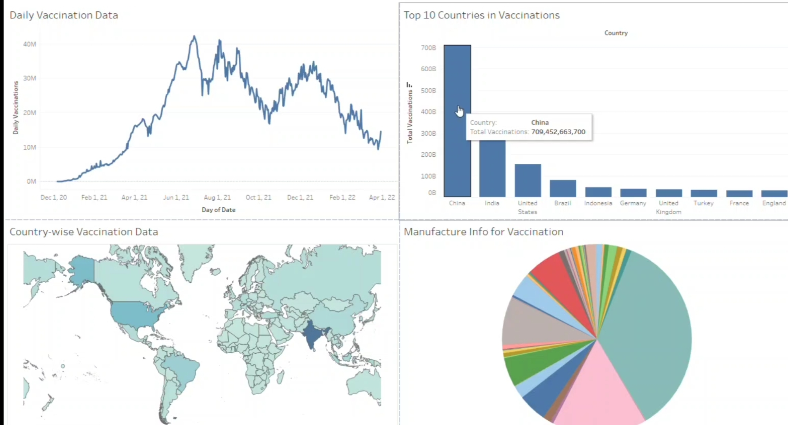

# COVID-19 Dashboard Using Tableau

## 🎯 Objective
Visualize the global impact of COVID-19 and vaccination progress through interactive visualizations using Tableau.

## 📂 Dataset
[Our World in Data - COVID-19](https://www.kaggle.com/datasets/gpreda/covid-world-vaccination-progress)

## 📊 Visualizations
- Daily vaccination trends (line chart)
- Vaccination totals by country (map & bar chart)
- Vaccine manufacturer distribution (pie chart)
- Filters by country, date, and vaccine type

## 🧰 Tools
- Tableau Public / Tableau Desktop
- Dataset: `country_vaccinations.csv`

## 🖼️ Dashboard Screenshot

